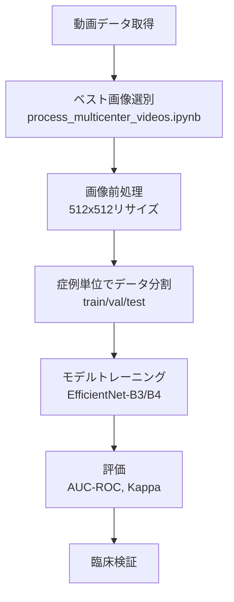
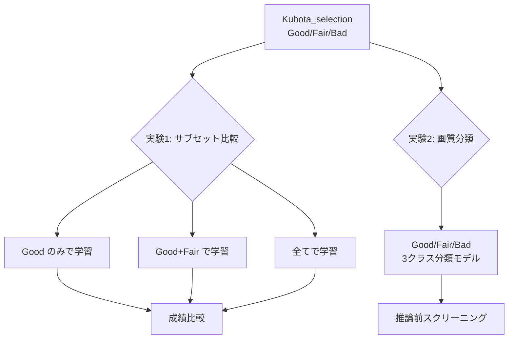

# 未熟児網膜症（ROP）病期推論AI 開発仕様書

**Version 1.0**

---

## 概要

- **画像・動画の保存場所**: `E:\Multicenter_ROP_study`
- **患者データ**: `E:\Multicenter_ROP_study\multicenter_patient_data_20260110.xlsx`
- **ベスト画像選別スクリプト**: `C:\Users\ykita\ROP_AI_project\ROP_project\multicenter_study\process_multicenter_videos.ipynb`

---

## 1. プロジェクト概要

### 1.1 目的

深層学習を用いて、乳児眼底写真からROP（未熟児網膜症）の病期を自動推論するAIシステムを開発する。主に後極の写真を対象とし、臨床現場での診断支援および重症度評価の標準化に貢献することを目指す。

### 1.2 データセット概要

| 項目 | 内容 |
|------|------|
| 総症例数 | 300症例 |
| 総画像数 | 8,800枚 |
| 撮影部位 | 後極中心 |
| データ収集 | 多施設共同研究 |

---

## 2. データ仕様

### 2.1 メタデータ項目

| 列 | 項目 | 説明 |
|----|------|------|
| A | 動画番号 | 識別用ID |
| B | 施設 | データ収集施設 |
| C | 性別 | 患者の性別 |
| D | 在胎週数 | 出生時の妊娠週数 |
| E | 出生体重 | 生まれた時の体重（g） |
| F | 修正週数 | 撮影時の修正週数（在胎週数＋生後週数） |

### 2.2 臨床評価項目

| 列 | 項目 | 説明 |
|----|------|------|
| G | Zone | 血管到達範囲（1-3）。1が最も未熟、3が最も発達 |
| H | Stage | 網膜変化の重症度（0-3）。0は正常、3が最重症（網膜剥離前） |
| I | Plus | 血管蛇行・拡張（normal/preplus/plus）。診察医により評価が変動 |
| J | Aggressive ROP | 急速進行型。該当時はZone/Stageによらず即治療適応 |
| K | Act-ROPスコア | ROP activity score（0-22）。4項目から算出される定量的重症度指標 |
| L | 重症度分類 | mild（0-7）/ moderate（8-12）/ severe（13-22） |
| M | 治療適応 | 治療すべきかどうかの判断（社会的要因は除外） |
| N | コメント | 遺伝子異常等の特記事項 |

> **参考文献**: Act-ROPスコアの原著論文 [DOI: 10.1001/jamaophthalmol.2018.5984](https://doi.org/10.1001/jamaophthalmol.2018.5984)

---

## 3. 推奨モデルアーキテクチャ

### 3.1 第一候補：EfficientNet-B3 / B4

- ImageNet事前学習モデルからの転移学習を前提とする
- 眼底画像タスク（糖尿病網膜症、緑内障）で多数の実績あり
- パラメータ効率が高く、8,800枚規模のデータセットで過学習リスクを抑制
- B3（300×300基準）またはB4（380×380基準）を推奨

### 3.2 第二候補：Vision Transformer (ViT-B/16)

- Plus病変（血管蛇行・拡張）のような広域パターン認識にself-attentionが有効
- ImageNet-21kまたはRetFound（眼底特化基盤モデル）からの転移学習を推奨
- 8,800枚では学習が不安定になる可能性があるため、十分な正則化が必要

### 3.3 第三候補：ConvNeXt-Tiny / Small

- CNNとTransformerの利点を組み合わせた最新アーキテクチャ
- EfficientNetと同等以上の性能を示す報告が増加

---

## 4. 画像解像度

### 4.1 主推奨：512×512ピクセル

後極中心の撮影において、血管の蛇行・拡張（Plus）やdemarcation line（Stage判定）の検出に十分な解像度を確保。計算コストと情報量のバランスが良好であり、ROPのAI研究で最も多く採用されている解像度帯である。

### 4.2 代替案

| 解像度 | 適用場面 |
|--------|----------|
| 384×384 | 計算リソースが限られる場合、Zone分類中心のタスク |
| 512×512 | **標準推奨（主推奨）** |
| 768×768 | Stage 1-2の微細な境界線検出を重視する場合 |

---

## 5. タスク設計

### 5.1 マルチタスク学習アーキテクチャ

予測対象が複数存在するため、共有Backboneから複数のHeadを分岐させるマルチタスク学習を推奨する。

#### 予測タスク一覧

| タスク | 出力形式 | クラス数 |
|--------|----------|----------|
| Zone分類 | 多クラス分類 | 3（Zone 1/2/3） |
| Stage分類 | 多クラス分類 | 4（Stage 0/1/2/3） |
| Plus分類 | 多クラス分類 | 3（normal/preplus/plus） |
| Aggressive ROP | 二値分類 | 2（Yes/No） |
| 治療適応 | 二値分類 | 2（Yes/No） |

#### マルチタスク学習の利点

- 各タスク間の相関を学習でき、特にラベルが主観的なPlus判定の安定化が期待できる
- 共有表現による正則化効果で汎化性能が向上
- Act-ROPスコアをordinal regressionで直接予測する手法も検討価値あり

---

## 6. Data Augmentation

### 6.1 推奨する手法

| 手法 | 理由 |
|------|------|
| 回転（0-360°） | 眼底撮影の向きは臨床的意味を持たない |
| 水平反転 | 左右眼の対称性に対応 |
| 軽度の色調変動 | 施設間の照明・カメラ特性の違いを吸収 |
| 軽度のブラー | 撮影時のピント変動をシミュレート |
| CLAHE適用有無の変動 | 前処理の有無への頑健性向上 |
| Random crop + resize | 撮影範囲の微小な変動に対応 |

### 6.2 避けるべき手法

| 手法 | 理由 |
|------|------|
| Mixup / CutMix | 異常所見の有無でGradeが決まるため、画像混合はラベルとの整合性が崩れる |
| 強いElastic変形 | 血管走行パターン（Plus判定の根拠）が歪む |
| 極端なコントラスト変更 | demarcation lineが消失または偽陽性化する |
| GridMask / Cutout | 病変部位を隠すとラベルとの不整合が生じる |

---

## 7. 実装上の注意点

### 7.1 データ分割

- **症例単位での分割を厳守**：同一患者の画像が異なるセット（train/val/test）に混入しないよう注意
- **層化抽出**：多施設データのため、施設分布が各セットで偏らないよう実施
- **Leave-one-site-out検証**：特定施設を丸ごとtest setに回す検証も検討

### 7.2 クラス不均衡対策

- Aggressive ROPや重症例は少数と予想されるため、**weighted loss**または**focal loss**を検討
- オーバーサンプリングは同一症例の重複使用に注意

### 7.3 ラベルの信頼性

- Plus判定は診察医依存のため、施設間でのアノテーション基準のばらつきに注意
- 可能であれば、一部症例を複数医師で再評価し**inter-rater reliability**を測定
- **Label smoothing**の適用も検討価値あり

### 7.4 多施設データの利点

- 施設間変動（カメラ機種、照明、撮影者の技量）がすでに含まれており、**汎化性能が期待できる**
- 単施設研究より**外部妥当性の主張が強くなる**
- 過度なdomain adaptation技法は不要。色調のnormalization程度で十分

---

## 8. 評価指標

### 8.1 分類タスク

| 指標 | 用途 |
|------|------|
| AUC-ROC | 二値分類（Aggressive ROP、治療適応）の総合性能 |
| Quadratic Weighted Kappa | 順序性のある多クラス分類（Zone, Stage） |
| Sensitivity / Specificity | 臨床的に重要な閾値での性能評価 |
| Confusion Matrix | 誤分類パターンの詳細分析 |

### 8.2 臨床的観点

- **治療適応の見逃し（False Negative）を最小化することが最優先**
- Sensitivity **95%以上**を目標とし、その条件下でのSpecificityを最大化
- 専門医との一致率（**Cohen's Kappa**）も報告

---

## 9. まとめ

| 項目 | 推奨 |
|------|------|
| アーキテクチャ | EfficientNet-B3/B4（第一候補） |
| 画像解像度 | 512×512ピクセル |
| タスク設計 | マルチタスク学習（Zone/Stage/Plus/AROP/治療適応） |
| 転移学習 | ImageNet事前学習必須 |
| Data Augmentation | 回転、反転、色調変動（Mixup/CutMix禁止） |
| データ分割 | 症例単位、施設バランスを考慮した層化抽出 |

---

## ワークフロー

---

## 10. 画質選別データによる追加実験（2026年1月）

### 10.1 背景

久保田先生により、抽出画像を以下の3群に選別いただいた:

| 画質分類 | 定義 | 枚数 |
|----------|------|------|
| **Good** | 判定に適している画像 | 4,333枚 |
| **Fair** | 画質はあまり良くないが判定には使えそうな画像 | 1,892枚 |
| **Bad** | 判定には使わない低画質画像 | 1,122枚 |

**データ保存場所**: `E:\Multicenter_ROP_study\Multicenter_images\Kubota_selection`

### 10.2 実験1: 画質サブセットによるROP分類成績比較

| 条件 | 使用画像 | 枚数 |
|------|----------|------|
| 条件① | Good のみ | 4,333枚 |
| 条件② | Good + Fair | 6,225枚 |
| 条件③ | 全て（Good + Fair + Bad） | 7,347枚 |

**目的**: 画質による学習データの選別が、ROP分類精度に与える影響を検証

**手法**:
- 既存 `train_rop_classifier.ipynb` のv3設定を使用
- EfficientNet-B0、512×512、MixUp、高ドロップアウト
- 5-fold cross-validation（症例単位分割）

**評価指標**:
- Zone/Stage/Plus分類: Accuracy, Quadratic Weighted Kappa
- Aggressive ROP/治療適応: AUC-ROC, Sensitivity, Specificity

**実装ファイル**: `train_rop_classifier_quality_comparison.ipynb`

### 10.3 実験2: 画質分類モデルの作成

**目的**: 画像をGood/Fair/Badに自動分類するモデルを開発

**用途**: 推論前スクリーニング（低画質画像の除外）

**アーキテクチャ**:
- バックボーン: EfficientNet-B0
- 出力: 3クラス分類（Good/Fair/Bad）
- 入力サイズ: 512×512

**評価指標**: Accuracy, Macro F1-score, Confusion Matrix

**実装ファイル**: `train_quality_classifier.ipynb`

### 10.4 ワークフロー

